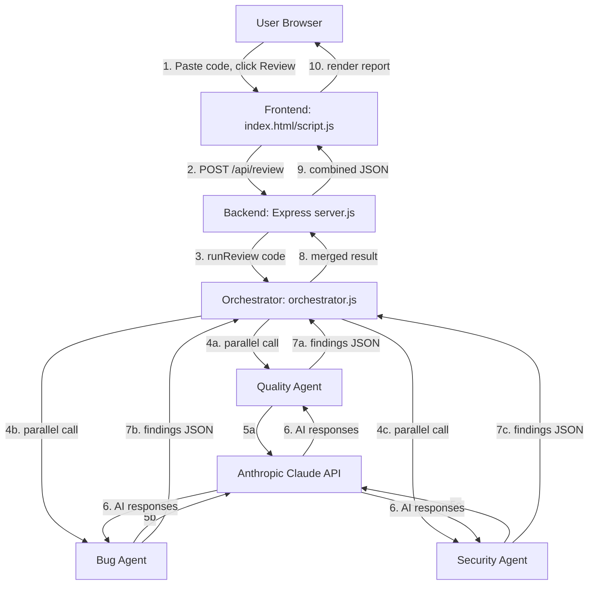
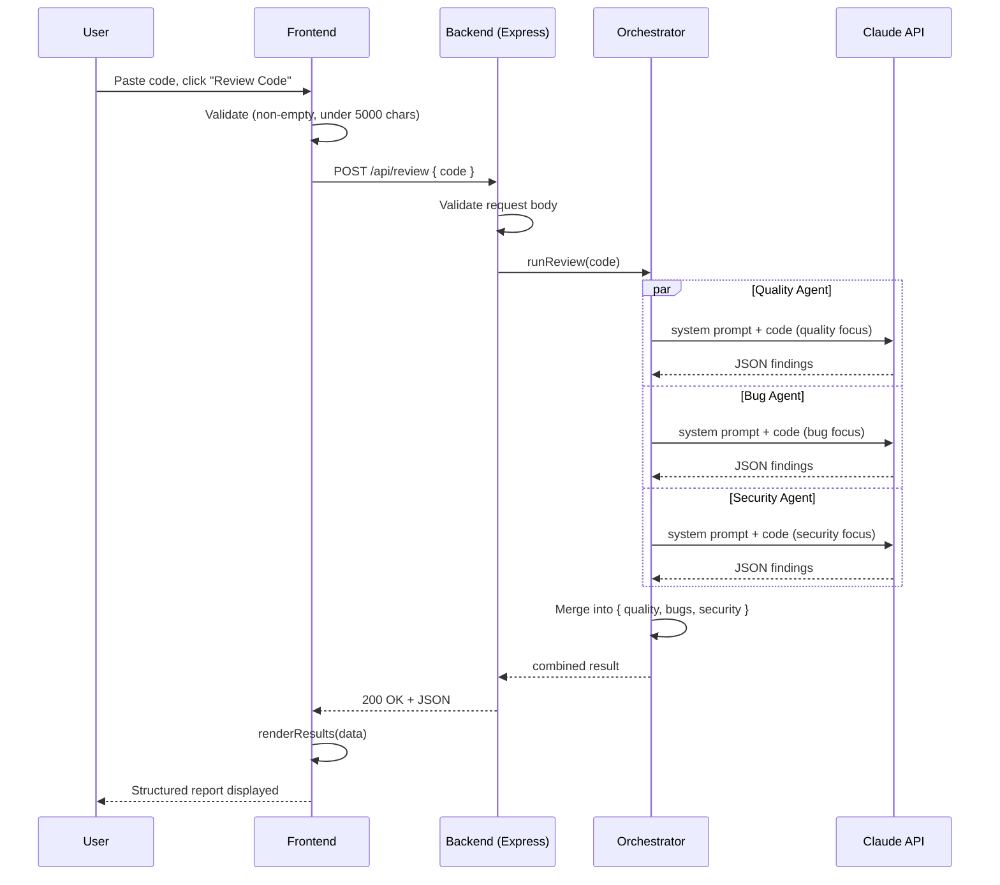

# ReviewCrew — System Architecture

## Overview
ReviewCrew follows an **Orchestrator-Workers** pattern. A single backend endpoint receives code, an orchestrator function triggers three independent AI agent calls in parallel, and their results are merged into one structured response.

## Component Diagram

## Request Lifecycle (Sequence Diagram)

## AI Interaction Model
- Each agent (Quality, Bug, Security) makes an **independent** Claude API call with its own system prompt.
- Prompts explicitly instruct each agent to ignore concerns outside its focus area, preventing overlapping/redundant findings.
- All three calls run in parallel (`Promise.all` or `Promise.allSettled`) to keep total latency close to a single call's latency rather than 3x.
- Each response is parsed as JSON independently; a malformed response from one agent is handled gracefully (fallback empty findings + error flag) without crashing the other two.

## External Services
- **Anthropic Claude API** — sole external dependency for v1.0.
- No database service, no auth provider, no GitHub API integration in v1.0.

## Hosting Architecture
- **Backend:** Render Web Service (Node.js/Express), environment variables (API key) stored in Render's dashboard, never committed.
- **Frontend:** Render Static Site (or GitHub Pages as fallback), calling the backend's public URL.
- CORS on the backend explicitly allows the deployed frontend's origin.

## Why This Architecture
- **Stateless:** no database needed, matching the PRD's explicit v1.0 scope (no accounts, no history).
- **Parallelizable:** the 3-agent design naturally benefits from concurrent execution, keeping the UX responsive despite 3 separate LLM calls.
- **Clean separation of concerns:** `server.js` only handles HTTP routing; `orchestrator.js` only coordinates; each `agents/*.js` file only knows how to talk to Claude for its one specialty. This makes the codebase easy to explain in an interview and easy for open-source contributors to navigate.
