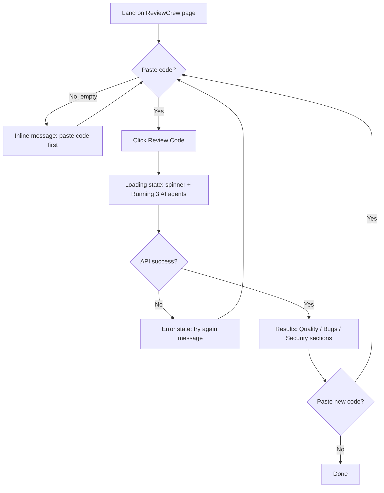

# ReviewCrew — UI & User Flow

## Overview
ReviewCrew is a **single-page application** with one screen and four distinct states layered on top of it: `idle`, `loading`, `results`, `error`. There is no multi-page navigation — every state exists because it maps directly to a real moment in the user's flow, not for decoration.

## User Flow Diagram



## Screen Flow
Single screen, 4 states:
1. **Idle** — default landing state, empty input.
2. **Loading** — shown immediately after clicking "Review Code," while the 3 agents run.
3. **Results** — the combined report, rendered in 3 labeled sections.
4. **Error** — shown if the request fails or times out.

## Wireframes (Low-Fidelity)

### Idle State
```
┌──────────────────────────────────────────────┐
│  ReviewCrew                                   │
│  Multi-agent AI code review, instantly.       │
├──────────────────────────────────────────────┤
│  ┌──────────────────────────────────────────┐ │
│  │ [ paste your code here...              ] │ │
│  │ [                                       ] │ │
│  │ [                                       ] │ │
│  └──────────────────────────────────────────┘ │
│                                                │
│              [  Review Code  ]                │
└──────────────────────────────────────────────┘
```

### Loading State
```
┌──────────────────────────────────────────────┐
│  ReviewCrew                                   │
├──────────────────────────────────────────────┤
│              ⟳  spinner                       │
│     Running 3 AI agents on your code...       │
│                                                │
│         [  Review Code (disabled)  ]          │
└──────────────────────────────────────────────┘
```

### Results State
```
┌──────────────────────────────────────────────┐
│  ReviewCrew                    [ New Review ] │
├──────────────────────────────────────────────┤
│  🔍 Quality Findings                          │
│   • [HIGH] Issue text — explanation           │
│   • [LOW]  Issue text — explanation           │
├──────────────────────────────────────────────┤
│  🐛 Bug Findings                              │
│   • No issues found in this category          │
├──────────────────────────────────────────────┤
│  🔒 Security Findings                         │
│   • [MEDIUM] Issue text — explanation         │
└──────────────────────────────────────────────┘
```

### Error State
```
┌──────────────────────────────────────────────┐
│  ReviewCrew                                   │
├──────────────────────────────────────────────┤
│  ⚠ Something went wrong.                      │
│    Please check your connection and try again.│
│                                                │
│              [  Try Again  ]                  │
└──────────────────────────────────────────────┘
```

## Navigation
None — no header nav, no routing library, no multi-page structure. This is a deliberate simplicity choice: the tool does exactly one thing, so the UI does exactly one thing.

## Responsive Behavior
On narrow screens (≤600px), all elements stack vertically with reduced padding (finalized in Blueprint Day 7). No layout element is hidden or removed on mobile — only rearranged.
